Manon Gnaedig
Pierre-Louis Pécheux

# Machine Learning – Project

## 1. Our dataset

### 1. Presentation

At the beginning we wanted to find a dataset linked with our IE² project but we didn’t find something
really useful. So we stay in the health field and we chose the breast cancer dataset.

The dataset had been made to analyse cell characteristics. They took cells from breast, there are cancer
cells and normal cells. Our dataset has 699 instances and 10 attributes.
The phenotypes for characterisation are:

- Sample ID (code number)
- Clump thickness
- Uniformity of cell size
- Uniformity of cell shape
- Marginal adhesion
- Single epithelial cell size
- Number of bare nuclei
- Bland chromatin
- Number of normal nuclei
- Mitosis
- Classes, i.e. diagnosis benign or malignant

It is a dataset for classification, our goal to predict if the cell is benign or malignant with our data.
Benign and malignant cells have different morphological and functional characteristics.

We do not have the real measures, every predictor value is a score between 1 and 10. So we do not
have numeric value. We do not know the signification of the value, we also do not know if the score is
linear or not. That is why we do not know if a uniformity of cell size of 3 is 3 times less uniform that a
cell with an uniformity of 1 or if it is another scale and the cell with 1 can be 5 or 6 time more uniform.
There are 16 missing value. They all are for the predictor _bare nuclei_.

### 2. Cleaning

The dataset has no header, so we add the column names in order to have an easier manipulation of
the data. We also want to change the name for the response variable. It was 2 for benign and 4 for
malignant, we change 2 in 0 and 4 in 1. We also add a column _classes_ , with benign or malignant. Thus
it is easier to understand when we look quickly to the values. With the function _head()_ we can the our
6 first rows.

We have 16 missing data that are all in the _bare_nuclei_ column. As the number of observation with
missing data is low compared to the total number of observation, we could just ignore these 16
observations for the rest of the study and loose small amount of data. However, we could also replace
the missing values by the mean of the column. It does not change the global mean but reduces the
variance. We can also try to apply some algorithm that will guess the value with the MICE library. We


could also use the library Amelia but we have to make the assumption that all variables follow a
multivariate law.

We choose to remove rows with missing data because we do not want to add bias our dataset. We will
try later to perform the same study by predicting the missing values using the knn regression and the
linear regression and then add the 16 new rows.

### 3. Visualization

We begin to visualise our data with the plot function. But the most relevant plot is box plot because it
is better to display binary variables.

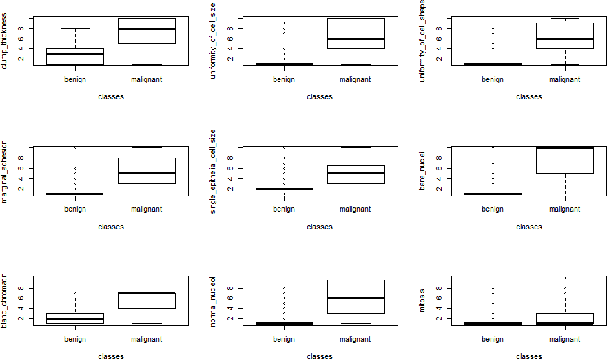
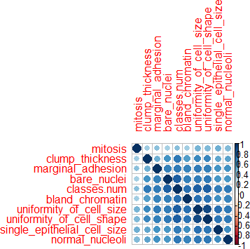

We can see that for almost all predictors, the mean of the observation of malignant cells are different
to benign cells.

```
We can also see the correlation between
variables. Therefore, we plot the correlation
matrix and we can see that all variables are to
some extend correlated.
```

## 2. Classifiers test

### 1. K-nearest-neighbour

K-nearest neighbour algorithm is based on the fact that half of the information provided by the training
set is contained in the nearest neighbour (asymptotically).
However, the KNN classifier breaks down for big dimension of
datasets. We have 10 predictors and that is already a lot for KNN.

```
We used the knn function in R for K between 1 and 15.
```
```
So we compute the Error rate of the classifier for k from 1 to 15. This time the optimal k would have been 5. But we repeated the process in order to have the mean of the optimal ks by using a loop.
```
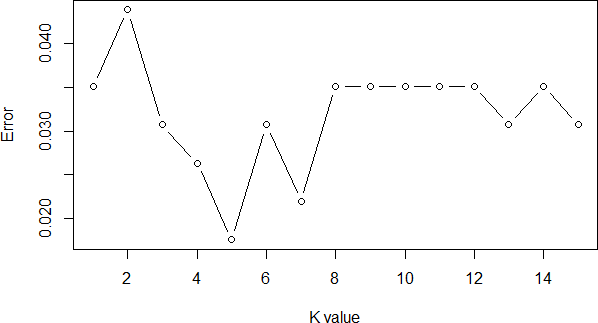
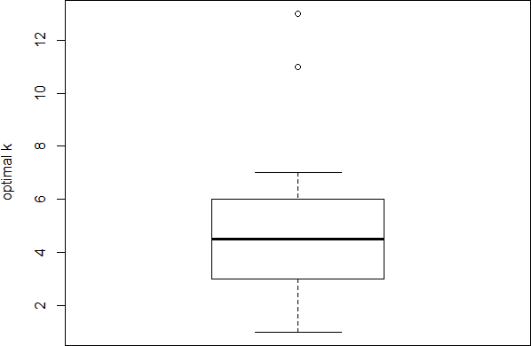
On this graph we can see that the best value is 5. Thus we apply the knn function for k=5. We obtain
the following matrix of confusion.

We have a really good result. We only have 3 false negative and one false positive.

### 2. Linear Discriminant Analysis (LDA)

LDA is a generative model and uses the full likelihood based on the joint distribution of X and Y. LDA
assumes that all classes share the same covariance matrix.

```
We obtain the following confusion matrix:
```
```
LDA is usually much more stable than QDA. This method is
recommended when n is small.
```
### 3. Quadratic Discriminant Analysis

QDA works like LDA but it do not assumes that all classes share the same covariance matrix.

```
Results are less good than with LDA for the detection of benign
cells. But it is better than LDA for detection of malignant cells.
To choose if we want to use LDA or QDA for this case, it depend
on our goal. If we really do not want to miss some malignant
cell, which mean disease case we should choose QDA. But if we
```
```
Prediction
Benign Malignant
Benign 145 3
Malignant 1 79
```
```
Prediction
Benign Malignant
Benign 145 3
Malignant 6 74
```
```
Prediction
Benign Malignant
Benign 137 11
Malignant 2 78
```

do not want to fear people or give inappropriate treatment we should choose LDA. However, detect
all disease cases seems to be the best choice.

### 4. Naïve Bayes

For Naive Bayes classifier, we set the covariance matrix to diagonal matrix. This assumption means
that the predictors are conditionally independent given the class variable Y.

They usually outperform other methods when p is very large.

```
Prediction
Benign Malignant
Benign 143 10
Malignant 1 78
```
### 5. Logistic regression

Logistic regression is a discriminative model and uses the conditional likelihood based on the
conditional probabilities Pk(x).

logReg models fit by maximizing the conditional likelihood.

We use the binomial logistic regression because we have only two classes.

```
Prediction
Benign Malignant
Benign 144 4
Malignant 3 77
```
## 3. Tree classifiers

Trees can easily handle qualitative predictors without the need to create dummy variables. But the
algorithm of partitioning tends to favor predictor with many levels: they should be avoided. In our case
this is not a problem because every predictor has the same number of level.

We used the function _rpart_ with _xval = 10_ , it is the number of cross validation. _minbucket_ is the
minimum number of observations in any leaf, we choose 5. _cp_ is complexity parameter, any split that
does not decrease the overall lack of fit by a factor of cp is not attempted. In order to get the optimal
tree size adaptively chosen from the data we use the _prune_ algorithm for cp=0.039.

```
Tree Tree pruning
```
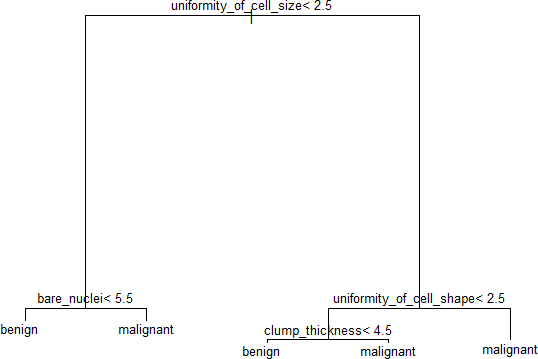

```
Prediction
```
```
Benign Malignant
Benign 140 8
Malignant^^1 
```
```
Prediction
```
```
Benign Malignant
Benign 140 8
Malignant 1 79
Used predictors: uniformity of cell size and
shape, bare nuclei and clump thickness
```
```
Used predictors : uniformity of size and bare
nuclei
```
## 4. Comparison

### 1. Cross Validation

We have chosen the 5 fold cross validation method in order to estimate the error rate of each model
without seeing the test set. The idea is to randomly divide the data into 5 equal-sized parts. We live
out part k and we fit the model to the other parts combined and then obtain the prediction for the left

- out kth part. We do this for k from 1 to 5 and we combine the results.

```
We can compare our different models that uses as
training data only the rows that include no ‘NA’ :
```
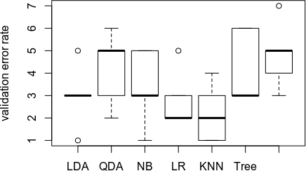
```
By using linear regression model to predict the ‘NA’
of the training set, we were able to add 16 more
rows, hoping to improve the quality of the
classification:

```
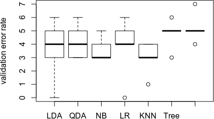
Even by repeating the process, we cannot say that by estimating the missing values with linear
regression we improve significantly the quality of the classification. Unfortunately, we did not succeed
to do the same comparison by replacing the missing values with the KNN regression.

### 2. Comparison with ROC curve

As we are in a problem of classification with two classes, we can choose a model also by dealing with
the false positive and true negative error rates. Therefore it is interesting to plot the ROC curve.
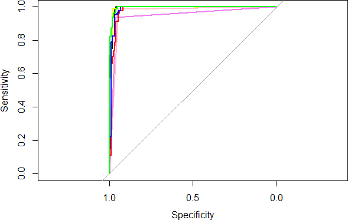
Green=Logistic Regression Blue=Naïve Bayes Red=QDA Purple=Pruning Tree Pink=Tree Yellow=KNN Black=LDA
For this plot, the best ROC is for LDA
We can repeat the process using different random test sets among the dataset to compute the
indicators.

```
We can compare the model’s test error rates And we can also compute the Area Under the Curve
of the ROC

```

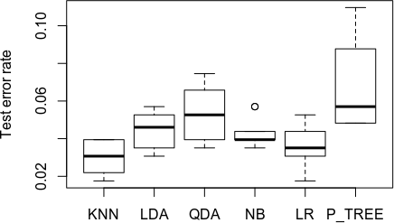
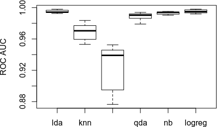
It is interesting to see that althrougth knn classifier offers better performances on test error rate
compared to the logistic regression model, the LogReg model offers definitly better with the AUC.

## 5. Regression

We try to do a regression in order to have the missing data of the predictor bare_nuclei. Indeed, we
hope that by estimating a value for the missing values will allow us to add the missing rows to the
dataset and improve the classification models. At first we tested linear regression and knn regression
on our dataset without the row with missing data.

```
KNN Regression
Linear Regression
```
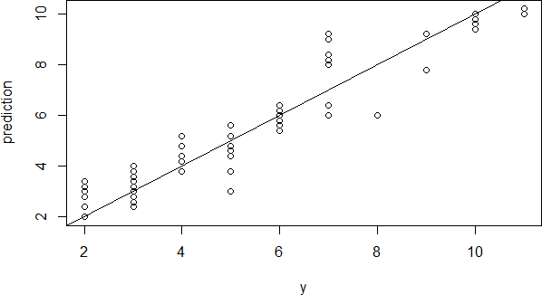

> Error : 0.2219298   > Error : 3.48129263
```
KNN regression provide better result than linear regression.

We used model selection in order to know which predictor are more useful to predict our missing data.
We used the function regsubsets and obtain the following results.

```
BIC Adjusted R²
```
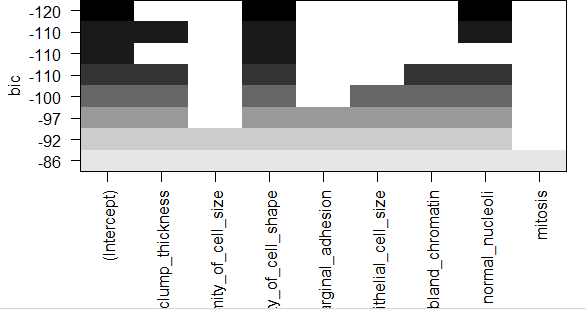
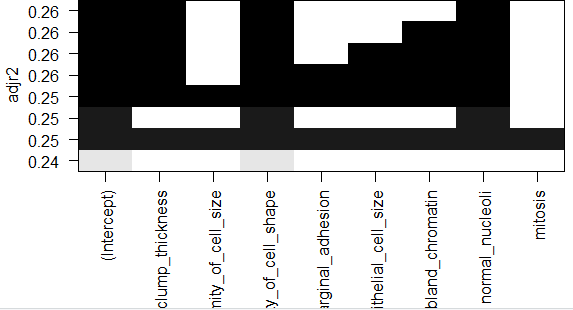
##### MSE = 3.543749 MSE = 3.

```
Best predictors : Uniformity of cell shape, norma
l nucleoli
```
```
Best predictors : clump thickness, uniformity of
shape, normal nucleoli
```
Our results for BIC and adjusted R² are similar. We also used backward selection and optimal selection,
they both provide same results than forward regression.

Then, we used Ridge and Lasso regression.

```
Ridge Regression Lasso Regression
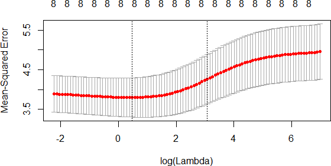
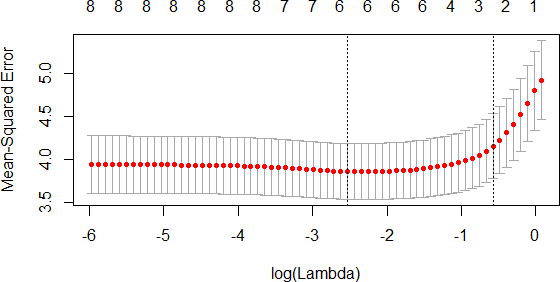
```

##### MSE = 3.437183 MSE = 3.

```
Best results : With 8 predictors Best results : with 6 predictors
```
Ridge and Lasso regression allow to delete a lower amount of predictors than BIC and adjusted R².


